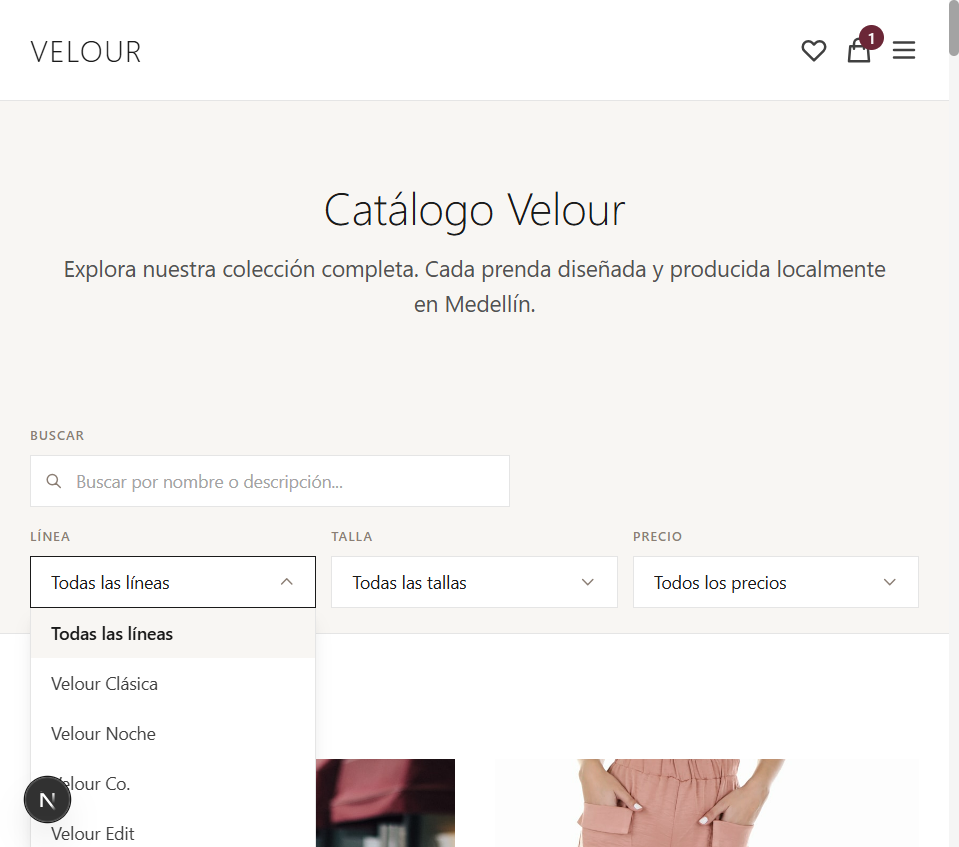
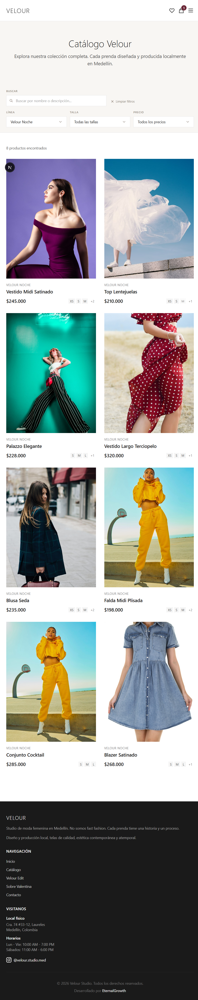
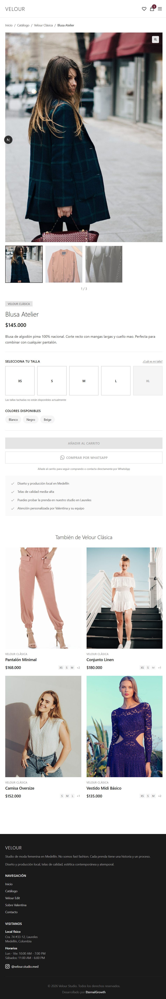
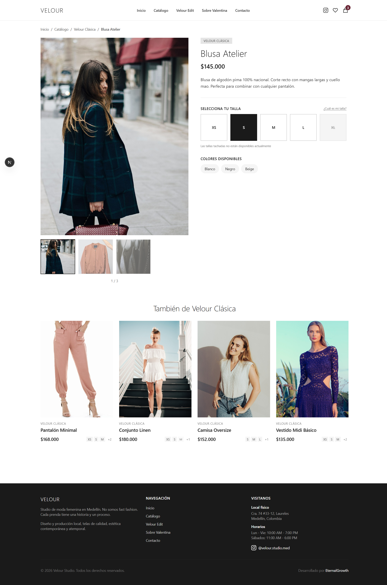
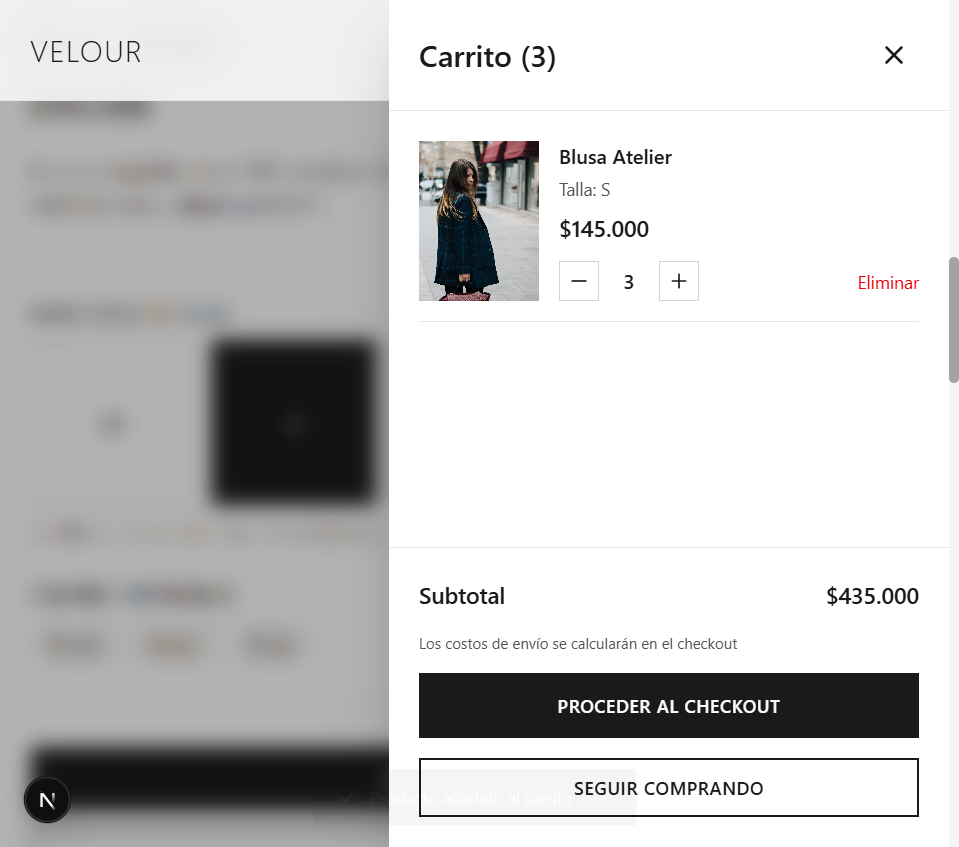
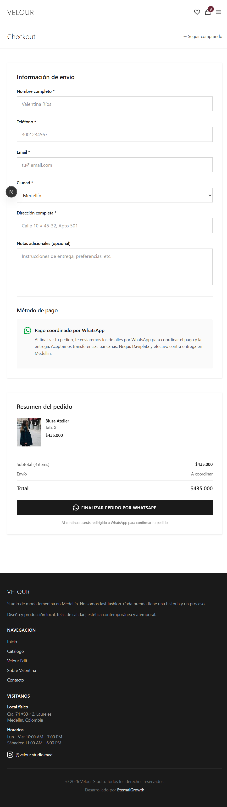
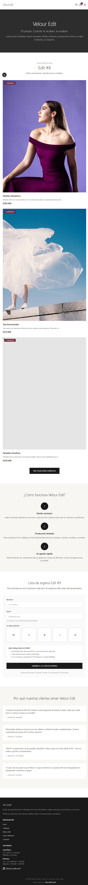
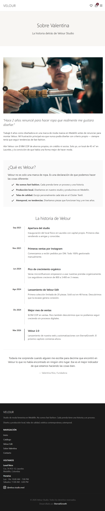
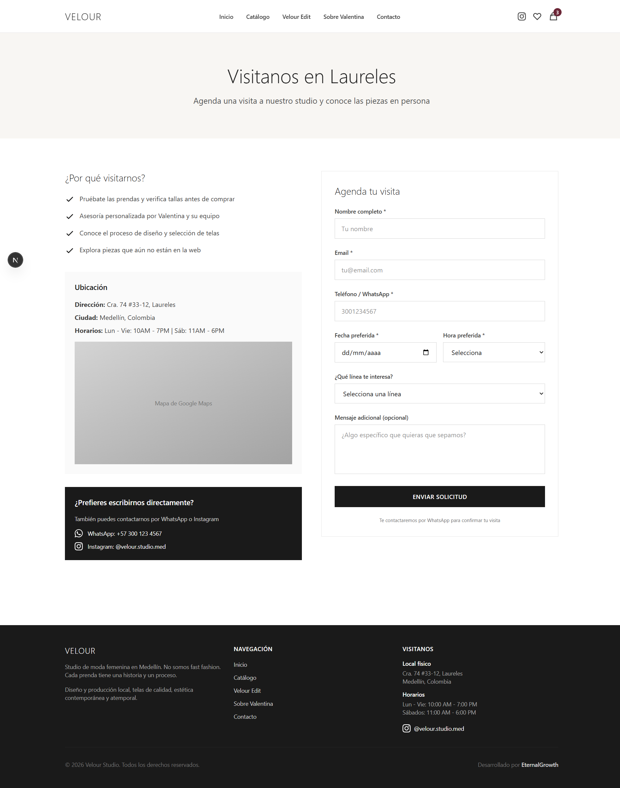
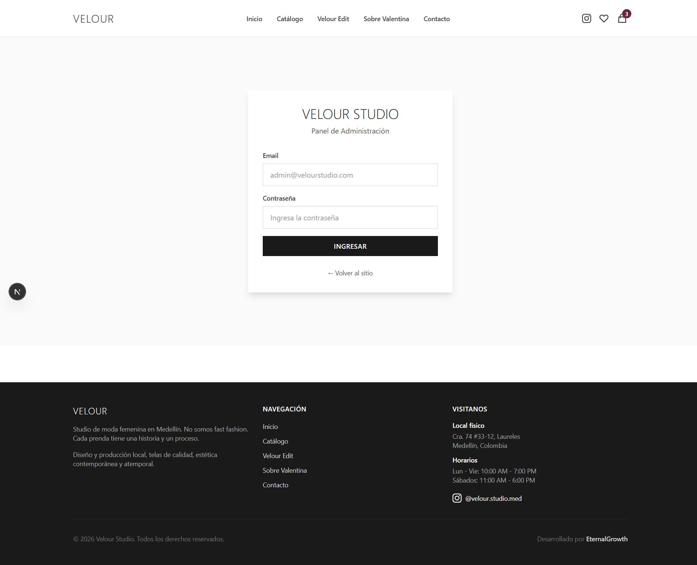

# Reporte de Pruebas Funcionales — Velour Studio

**Fecha:** 12 de marzo de 2026  
**Entorno:** Desarrollo local (`http://localhost:3000`)  
**Stack técnico:** Next.js 16 App Router · React 19 · Tailwind CSS v4 · NextAuth.js  
**Datos:** Productos mockeados en `app/lib/productos.js` (~30 ítems)  
**Tester:** Agente automatizado (OpenCode)

---

## Resumen ejecutivo

Se realizaron pruebas funcionales manuales sobre las 9 páginas principales de la aplicación web Velour Studio. **Todas las páginas pasaron** las pruebas de renderizado, navegación y comportamiento esperado. Se identificaron 4 hallazgos menores de accesibilidad y performance, ninguno bloqueante para el funcionamiento de la aplicación.

---

## Tabla resumen de resultados

| #   | Página                          | URL                             | Resultado |
| --- | ------------------------------- | ------------------------------- | --------- |
| 1   | Homepage                        | `/`                             | ✅ PASS   |
| 2   | Catálogo                        | `/catalogo`                     | ✅ PASS   |
| 3   | Catálogo — filtro activo        | `/catalogo?linea=noche`         | ✅ PASS   |
| 4   | Catálogo — filtro + búsqueda    | `/catalogo` (combo)             | ✅ PASS   |
| 5   | Detalle de producto             | `/producto/clasica-1`           | ✅ PASS   |
| 6   | Producto con talla seleccionada | `/producto/clasica-1` + talla S | ✅ PASS   |
| 7   | Carrito (drawer)                | Abierto desde producto          | ✅ PASS   |
| 8   | Checkout                        | `/checkout`                     | ✅ PASS   |
| 9   | Velour Edit                     | `/velour-edit`                  | ✅ PASS   |
| 10  | Sobre Valentina                 | `/sobre-valentina`              | ✅ PASS   |
| 11  | Contacto                        | `/contacto`                     | ✅ PASS   |
| 12  | Admin (login)                   | `/admin`                        | ✅ PASS   |

---

## Detalle por página

---

### 1. Homepage (`/`)

**Descripción:** Página de entrada principal de la aplicación. Incluye hero section, navegación global, enlaces a líneas de producto y footer.

**Elementos verificados:**

- [x] Hero section visible con imagen y CTA
- [x] Navbar con enlaces a todas las secciones
- [x] Logo "VELOUR" con link a inicio
- [x] Footer con dirección, horarios e Instagram
- [x] Navegación funcional a `/catalogo`, `/velour-edit`, `/sobre-valentina`, `/contacto`

**Issues encontrados:**

- Imagen LCP sin atributo `loading="eager"` (performance warning en consola)
- Imagen preloaded no usada a tiempo por el browser (preload warning en consola)

---

### 2. Catálogo — Vista general (`/catalogo`)

**Descripción:** Listado completo de productos con sistema de filtrado por línea y buscador por texto.

**Elementos verificados:**

- [x] 30 productos renderizados correctamente
- [x] Cards con imagen, nombre, precio y tallas disponibles
- [x] Filtros por línea (Clásica, Noche, Resort, Especial) visibles
- [x] Campo de búsqueda funcional
- [x] Botón "Agregar a favoritos" en cada card

---

### 3. Catálogo — Filtro dropdown abierto

**Descripción:** Estado del dropdown de filtros desplegado, mostrando las opciones de línea disponibles.

**Elementos verificados:**

- [x] Dropdown se abre al hacer clic en el filtro
- [x] Opciones de línea visibles: Clásica, Noche, Resort, Especial
- [x] UI coherente con el diseño general

---

### 4. Catálogo — Filtrado por línea "Noche"

**Descripción:** Resultado de aplicar el filtro de línea "Noche". Se esperaban 8 productos.

**Elementos verificados:**

- [x] 8 productos de la línea Noche mostrados correctamente
- [x] Productos de otras líneas ocultos
- [x] Botón "Limpiar filtros" aparece solo cuando hay filtros activos
- [x] Contador de resultados actualizado

---

### 5. Detalle de producto — Sin talla seleccionada (`/producto/clasica-1`)

**Descripción:** Página de detalle de "Blusa Atelier". Galería de imágenes, selector de talla y color, botones de acción.

**Elementos verificados:**

- [x] Galería con 3 imágenes y controles de navegación
- [x] Breadcrumb: Inicio / Catálogo / Velour Clásica / Blusa Atelier
- [x] Selector de tallas (XS, S, M, L — XL deshabilitada/sin stock)
- [x] Colores disponibles mostrados: Blanco, Negro, Beige
- [x] Botón "AÑADIR AL CARRITO" deshabilitado sin talla seleccionada
- [x] Botón "COMPRAR POR WHATSAPP" deshabilitado sin talla seleccionada
- [x] Sección "También de Velour Clásica" con 4 productos relacionados

---

### 6. Detalle de producto — Talla seleccionada (S)

**Descripción:** Mismo producto tras seleccionar la talla S. Los botones de acción deben habilitarse.

**Elementos verificados:**

- [x] Talla "S" visualmente marcada como seleccionada
- [x] Botón "AÑADIR AL CARRITO" habilitado
- [x] Botón "COMPRAR POR WHATSAPP" habilitado
- [x] Estado del selector coherente con la UI

---

### 7. Carrito — Drawer lateral

**Descripción:** Panel lateral del carrito que se abre automáticamente al agregar un producto. Muestra resumen de ítems, cantidades y total.

**Elementos verificados:**

- [x] Drawer se abre automáticamente al agregar producto al carrito
- [x] Toast de confirmación "Producto añadido al carrito" aparece
- [x] Producto listado con imagen, nombre, talla y precio
- [x] Controles de cantidad (+/−) funcionales
- [x] Botón para eliminar ítem
- [x] Total calculado correctamente
- [x] Botón "Ir al checkout" visible

---

### 8. Checkout (`/checkout`)

**Descripción:** Formulario de finalización de compra. Incluye datos personales, dirección de entrega y resumen del pedido.

**Elementos verificados:**

- [x] Formulario completo renderizado
- [x] Resumen de pedido con productos, cantidades y total
- [x] Campos de datos personales presentes
- [x] Campos de dirección de entrega presentes
- [x] Botón de confirmar pedido visible

**Issues encontrados:**

- 6 campos de formulario sin `<label>` asociado ni atributos `id`/`name` (accesibilidad — WCAG 1.3.1)

---

### 9. Velour Edit (`/velour-edit`)

**Descripción:** Landing page de la colección especial "Velour Edit". Incluye contadores de stock, formulario de lista de espera y testimonios.

**Elementos verificados:**

- [x] Hero de la colección con imagen y descripción
- [x] Contadores de stock por producto
- [x] Formulario de waitlist (nombre + email)
- [x] Sección de testimonios de clientas
- [x] Navegación funcional

---

### 10. Sobre Valentina (`/sobre-valentina`)

**Descripción:** Página institucional con la historia de la fundadora, timeline de la marca y manifiesto.

**Elementos verificados:**

- [x] Foto y biografía de Valentina
- [x] Timeline de hitos de la marca
- [x] Texto del manifiesto de la marca
- [x] Diseño visual coherente con el resto de la aplicación

---

### 11. Contacto (`/contacto`)

**Descripción:** Página de contacto y reserva de citas. Incluye date picker, horarios disponibles y selector de tipo de consulta.

**Elementos verificados:**

- [x] Formulario de reserva con date picker funcional
- [x] Selector de horarios disponibles
- [x] Selector de línea / tipo de consulta
- [x] Información de contacto directo visible
- [x] Dirección del studio físico en Laureles

---

### 12. Admin — Login (`/admin`)

**Descripción:** Página de acceso al panel de administración. Protegida por autenticación (NextAuth.js).

**Elementos verificados:**

- [x] Formulario de login renderizado correctamente
- [x] Campos de email y contraseña presentes
- [x] Botón de "Iniciar sesión" visible
- [x] Ruta protegida (no expone contenido del panel sin autenticación)

**Issues encontrados:**

- 2 campos del formulario sin `<label>` asociado (accesibilidad)
- Campo contraseña sin atributo `autocomplete="current-password"` (usabilidad / password managers)

---

## Issues y Recomendaciones

### Issue 1 — Accesibilidad: campos de formulario sin `<label>` (Checkout)

**Severidad:** Media  
**Archivo:** `app/checkout/page.jsx`  
**Descripción:** 6 campos de entrada del formulario no tienen `<label>` asociado ni atributos `id`/`name`, lo que dificulta el uso con lectores de pantalla y no cumple WCAG 2.1 criterio 1.3.1.  
**Recomendación:** Agregar `<label htmlFor="...">` a cada campo y el atributo `id` correspondiente en el `<input>`.

### Issue 2 — Accesibilidad: campos de formulario sin `<label>` (Admin login)

**Severidad:** Media  
**Archivo:** `app/admin/page.jsx`  
**Descripción:** Los campos de email y contraseña del formulario de login no tienen `<label>` asociado.  
**Recomendación:** Mismo fix que Issue 1. Adicionalmente, agregar `autocomplete="current-password"` al campo de contraseña para compatibilidad con gestores de contraseñas.

### Issue 3 — Performance: imagen LCP sin `priority`/`eager`

**Severidad:** Baja  
**Archivo:** `app/page.js` (Homepage)  
**Descripción:** La imagen principal del hero (Largest Contentful Paint) no tiene el atributo `priority` en el componente `<Image>` de Next.js, lo que retrasa su carga y afecta el score de Core Web Vitals (LCP).  
**Recomendación:** Agregar `priority` al componente `<Image>` del hero: `<Image ... priority />`.

### Issue 4 — Performance: preload no utilizado a tiempo

**Severidad:** Baja  
**Archivo:** `app/page.js` (Homepage)  
**Descripción:** Una imagen es pre-cargada en el `<head>` pero no es utilizada dentro de la ventana de tiempo esperada por el browser, generando un warning de "preloaded but not used within a few seconds".  
**Recomendación:** Revisar si el preload es necesario. Si no se usa de inmediato, eliminar el `<link rel="preload">` correspondiente para evitar desperdicio de ancho de banda.

---

## Conclusión

La aplicación Velour Studio se encuentra en un estado funcional sólido. Todas las páginas principales renderizan correctamente, los flujos críticos (catálogo → producto → carrito → checkout) funcionan sin errores, y los comportamientos condicionales de UI (botones habilitados/deshabilitados según estado) operan como se esperaba.

Los 4 issues identificados son de baja a media severidad y no bloquean ninguna funcionalidad. Se recomienda abordar los issues de accesibilidad (Issues 1 y 2) antes del lanzamiento público para cumplir con estándares básicos de inclusión.
